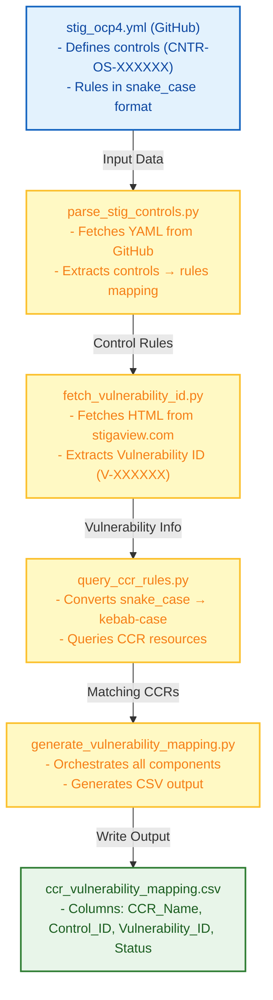

# OpenShift CCR to DISA STIG Vulnerability ID Mapper

A Python-based tool that programmatically generates a CSV mapping of OpenShift Compliance Operator ComplianceCheckResult (CCR) names to DISA STIG Vulnerability IDs.

## Problem Statement

When auditing OpenShift Container Platform (OCP) clusters against DISA STIG (Security Technical Implementation Guide) requirements, compliance teams need to correlate:

1. **ComplianceCheckResult (CCR) names** - The actual resource names in OpenShift (e.g., `rhcos4-stig-master-usbguard-allow-hid-and-hub`)
2. **Control IDs (CNTR-OS)** - The STIG control identifiers from the ComplianceAsCode content (e.g., `CNTR-OS-001030`)
3. **Vulnerability IDs (V-XXXXXX)** - The DISA STIG vulnerability identifiers (e.g., `V-257585`)

The challenge is that these three data sources are not directly correlated:

- The `stig_ocp4.yml` file from ComplianceAsCode defines controls and their associated rules in **snake_case** format
- OpenShift CCR resources use **kebab-case** naming (converted from snake_case)
- The Vulnerability IDs must be fetched dynamically from stigaview.com for each control

This tool bridges these gaps by:
1. Fetching the latest `stig_ocp4.yml` from the [ComplianceAsCode's GitHub repo](https://github.com/ComplianceAsCode/content/blob/master/controls/stig_ocp4.yml)
2. Extracting controls and their rules
3. Fetching Vulnerability IDs from stigaview.com for each control
4. Querying OpenShift CCR resources to find matching rule names
5. Generating a CSV with all the correlations

## Solution Overview

The solution consists of multiple Python modules that work together:



## Components

### 1. parse_stig_controls.py

Parses the STIG YAML file and extracts controls with their associated rules.

**Functions:**
- `load_yaml_file(url)` - Fetches YAML content from a URL (defaults to GitHub)
- `extract_controls_to_rules(yaml_content)` - Parses YAML and returns a dictionary mapping control IDs to their rules

**Example Output:**
```python
{
    "CNTR-OS-001030": [
        "configure_usbguard_auditbackend",
        "kernel_module_usb-storage_disabled",
        "package_usbguard_installed",
        "service_sshd_disabled",
        "service_usbguard_enabled",
        "usbguard_allow_hid_and_hub"
    ],
    "CNTR-OS-000010": [
        "ocp_insecure_allowed_registries_for_import",
        "ocp_insecure_registries"
    ]
}
```

### 2. fetch_vulnerability_id.py

Fetches the Vulnerability ID from stigaview.com for each control ID.

**Functions:**
- `fetch_vulnerability_id(control_id)` - Fetches and parses HTML from stigaview.com

**URL Pattern:**
```
https://stigaview.com/products/ocp/latest/{control_id}
```

**Example:**
```
Input:  CNTR-OS-001030
Output: V-257585
```

### 3. query_ccr_rules.py

Converts snake_case rule names to kebab-case and queries OpenShift CCR resources.

**Functions:**
- `snake_case_to_kebab_case(rule_name)` - Converts naming convention (e.g., `usbguard_allow_hid_and_hub` → `usbguard-allow-hid-and-hub`)
- `get_ccr_resources(namespace)` - Executes `oc get ccr` and returns JSON resources
- `find_matching_ccr_names(kebab_rule_name, ccr_resources)` - Filters CCR names containing the rule name
- `query_ccr_for_rule(rule_name)` - Main function combining the above

**Example:**
```
Input:  "usbguard_allow_hid_and_hub"
Output: ["rhcos4-stig-master-usbguard-allow-hid-and-hub",
         "rhcos4-stig-worker-usbguard-allow-hid-and-hub"]
```

### 4. generate_vulnerability_mapping.py

The main orchestration script that combines all components.

**Functions:**
- `generate_vulnerability_mapping(yaml_file, namespace, output_file)` - Main generation function
- `main()` - Entry point with command-line argument handling

**Features:**
- Fetches stig_ocp4.yml from GitHub by default
- Queries CCR resources once and reuses them
- Handles errors gracefully (missing controls, failed HTTP requests, no CCR matches)
- Outputs comprehensive CSV with all mappings

## Usage

### Basic Usage (GitHub URL)

```bash
python generate_vulnerability_mapping.py
```

This will:
1. Fetch `stig_ocp4.yml` from [GitHub](https://raw.githubusercontent.com/ComplianceAsCode/content/refs/heads/master/controls/stig_ocp4.yml)
2. Query your OpenShift cluster for CCR resources
3. Generate `ccr_vulnerability_mapping.csv`

## Output

The script generates `ccr_vulnerability_mapping.csv` with the following columns:

| Column | Description | Example |
|--------|-------------|---------|
| CCR_Name | The ComplianceCheckResult resource name | `rhcos4-stig-master-usbguard-allow-hid-and-hub` |
| Control_ID | The STIG control identifier | `CNTR-OS-001030` |
| Vulnerability_ID | The DISA STIG vulnerability identifier | `V-257585` |
| Status | The CCR compliance status (PASS or FAIL) | `PASS` or `FAIL` |

## Example Output

```csv
CCR_Name,Control_ID,Vulnerability_ID,Status
ocp4-stig-ocp-insecure-allowed-registries-for-import,CNTR-OS-000010,V-257505,PASS
ocp4-stig-ocp-insecure-registries,CNTR-OS-000010,V-257505,PASS
ocp4-stig-api-server-tls-security-profile,CNTR-OS-000020,V-257506,PASS
rhcos4-stig-master-usbguard-allow-hid-and-hub,CNTR-OS-001030,V-257585,FAIL
rhcos4-stig-worker-usbguard-allow-hid-and-hub,CNTR-OS-001030,V-257585,PASS
```

## Prerequisites

1. Install Python dependencies:
   ```bash
   pip install -r requirements.txt
   ```
   This installs the required modules:
   - `requests` - For fetching YAML from GitHub and HTML from stigaview.com
   - `pyyaml` - For parsing YAML files

2. Python 3.8+
- `oc` CLI tool configured and authenticated to an OpenShift cluster
- Access to stigaview.com (for fetching Vulnerability IDs)

## Dependencies

```
requests
pyyaml
```

## Requirements

- OpenShift cluster with Compliance Operator installed
- `oc` CLI tool configured with appropriate permissions
- Read access to:
  - GitHub: `https://raw.githubusercontent.com/ComplianceAsCode/content/refs/heads/master/controls/stig_ocp4.yml`
  - stigaview.com: `https://stigaview.com/products/ocp/latest/{control_id}`

## Limitations

1. **CCR Name Matching**: The matching logic uses substring matching, which may produce false positives if CCR names contain similar rule names.

2. **Manual Controls**: Controls with `status: manual` in stig_ocp4.yml may have empty rules arrays and won't generate mappings.

3. **Network Requirements**: Requires network access to:
   - GitHub (for fetching stig_ocp4.yml)
   - stigaview.com (for fetching Vulnerability IDs)
   - Your OpenShift cluster (for querying CCR resources)

## Troubleshooting

### "Could not fetch Vulnerability ID"
Check network connectivity to stigaview.com. Some controls may not have entries on the site.

### "No CCR matches found"
This is normal for rules that don't have corresponding CCR resources in your cluster. The script will still generate the CSV with the control and vulnerability information.

### "oc: command not found"
Ensure the `oc` CLI tool is installed and in your PATH.

## License

This tool is provided as-is for compliance auditing purposes.

## Contributing

Contributions are welcome. Please ensure any changes maintain backward compatibility and include appropriate error handling.
